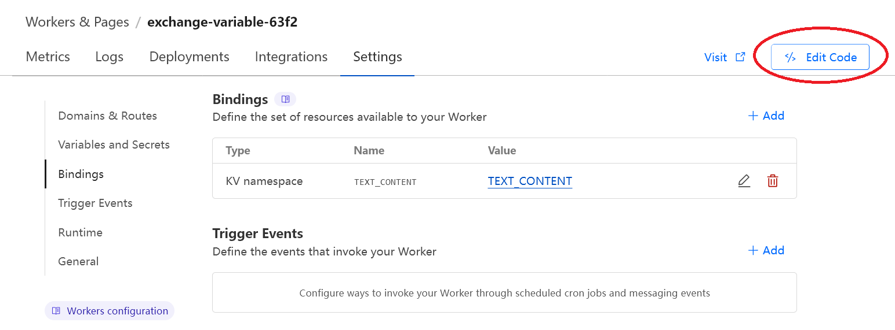

# Why this project?

This Workers project is used for deploying a Cloudflare Worker. The Worker can be used for exchanging dynamic IP address, dynamic TCP/UDP port number, or any other character based contents for exchange purposes. 

Suppose that a server changes to a new random IP address every 24hr, then the server can change a stored value on the Cloudflare server by just visiting a special URL through a script. Then, those who want to visit this server can have a script to visit a different URL to retrieve the stored text on Cloudflare for later uses (for example, the stored text may be "8.8.8.8:1000"). Usually the retrieval scripts will be set to be automated, running every hour or day.

# How to use

We can use it through any web browser and even on Terminal (automation with Shell scripts). 

## How to use on browser page

Visiting the URL to the Worker will display the stored content in plain text on the browser page (eg. visiting https://your-name.workers.dev on the browser). 

To change the content, we can add a special variable command to the URL. Say if we want to change the content to be the text "NewContent", we can visit "https://your-name.workers.dev/?stored-text=NewContent". First add "/?" to the end of the base URL, and "stored-text" is the variable name here. The variable name can be customized by changing 'stored-text' on line 32 of worker.js (the one wraped in single quotation marks: url.searchParams.get('stored-text');)

## How to use on command line

1. returns the text (replace with actual worker url)

    curl https://your-name.workers.dev
   
2. updating the text to "8.8.8.8:1000" or "abc"

    curl https://your-name.workers.dev/?stored-text=8.8.8.8:1000
   
    curl https://your-name.workers.dev/?stored-text=abc
   
# How to deploy it on Cloudflare Worker

## Short Description for Experienced Cloudflare Users

Get a new KV Namespace with one key, don't forget to bind it to the Worker. Lines of interest in worker.js:

> Line 6, KV NAMESPACE
> 
> Line 7, KV's Key Name
> 
> Line 32, Variable name refering to the URL

It may be helpful to read the "Common error messages" and "Notes" sections on the bottom of this readme

## Long Description for Beginners

1. login to your [Cloudflare](https://www.cloudflare.com/) account

2. On the left scroll bar, click on "Workers and Pages"->"KV", click on "create a namespace"

3. Enter "TEXT_CONTENT" as the Namespace Name, click "add". If you wish to use a different name, change line 6 on worker.js to match that name. **Note that it will take 10 to 20 min for the newly created Namespace to be usable, refer to the "Common error messages" section of the readme for details**

4. Click "view" on the new Namespace, go to "KV Pairs". Enter "currentText" as the key (If you wish to change to a different key name, change line 7 on worker.js), "value" can be anything as a temporary display. Then click "Add entry"

5. Clcik on "Overview" (under "Workers & Pages"), click "Create". In the Worker sub tab, click "Create Worker"

6. Give it a name that you like, and deploy it. Don't worry about the code, it can be changed later

7. After successfully deploying, go back to Overview, and click on the newly created worker

8. **(important!)** Click on "Settings"->"Bindings"->"+ Add"

9. On the right pop-up window, click "KV Namespace". Then select and enter the same KV name, and click "Deploy"

10. Click on "Edit Code". 

11. (This step is where a lot of error indications may pop up, I would advise also reading the below "Common error messages" section before doing this step) Copy the code from worker.js from Github, and paste it in, replacing all the code. Use the keyboard shortcut "ctrl + s" to save the file, and click "Deploy". After successfully deploying, click on "Visit" to visit the worker's URL in your web browser. Refer to the exampe URLs in the "How to use" document for more testing. 

# Common error messages

## Red underline for the KV name

When editing the Worker's code, there may be red error underline for the KV name (see the left side of the picture under step 11), but it should still work fine ~~(I heard that it is the fault of the new text editer on Cloudflare, not reading KV bindings correctly)~~. 

## KV name not found

When trying to save the worker code, there may be a error message pop-up saying the KV name you used does not exist, or the binding was incorrect. And this could very well happen even when you did everything right, even for my deployment. This is because that beside the possibility that you did do something wrong, the KV you created may be still in the process of deploying. Cloudflare needs to synchronize the creation of a new KV Namespace across all its edge locations around the world before the new KV becomes usable. Synchronization may take around 10 to 20 minutes, so there is nothing you can do but wait. But, there is always the possibility of an error in the KV name or Bindings. So if this problem persists after 30 min of creating your KV Namespace, you should check back on the KV itself, and "Bindings" in the Worker. 

Note that the above error message also indicates that the save action was blocked, so the code is still unsaved. If the code was saved, the "Deploy" button should light up. 

# Notes

**Limits on Character Length:** There is no specific limit set in the code for the character string, but it will read and store correctly for at least 1000 character strings, which is more than enough for it's purpose. 

**Server Syncing Time**: Please note that when using Cloudflare KV storage, there may be a delay in data synchronization across all edge locations across the world. Typically, it can take a few seconds to up to 60 seconds for updates to propagate. For best results, consider this delay when relying on recently updated data.

**Spaces in Command Line**: Command Line doesn't handle spaces in URLs very well. e.g. "curl https://your-name.workers.dev/?stored-text=New Content" in the terminal will fail. We have to replace spaces with "%20": "curl https://your-name.workers.dev/?stored-text=New%20Content". Browsers will automatically translate spaces to "%20". 

